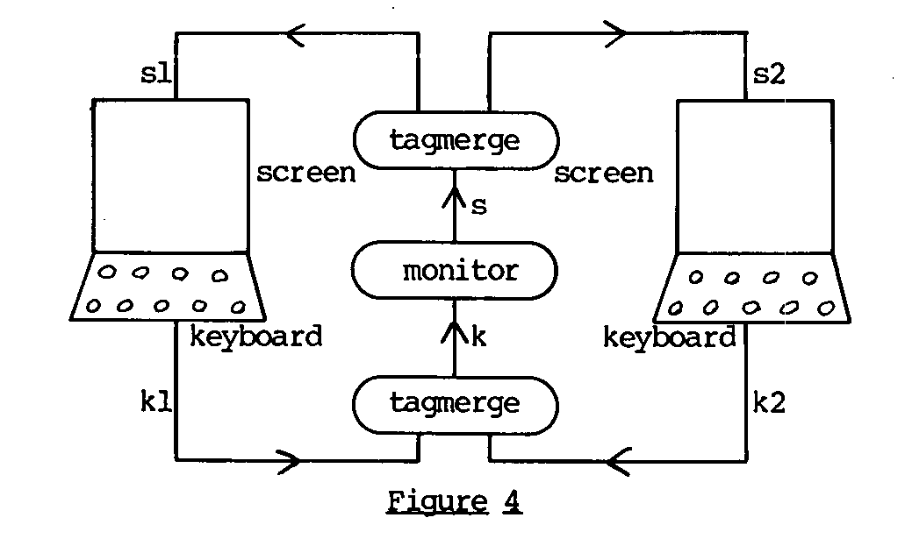
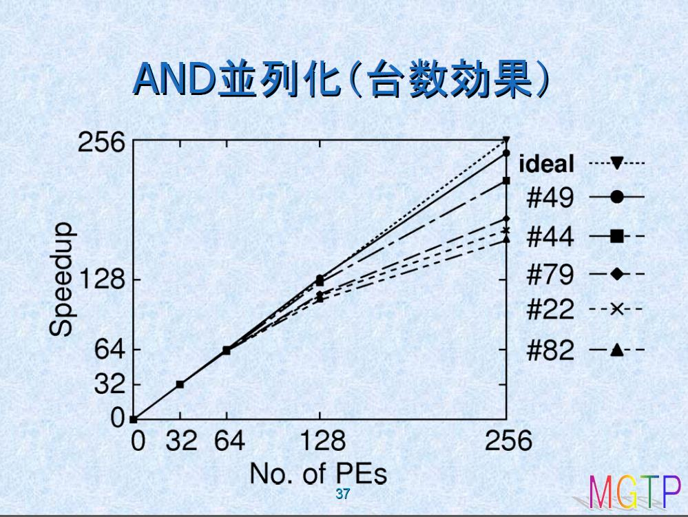
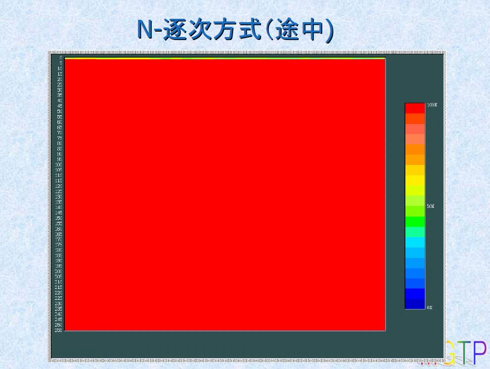
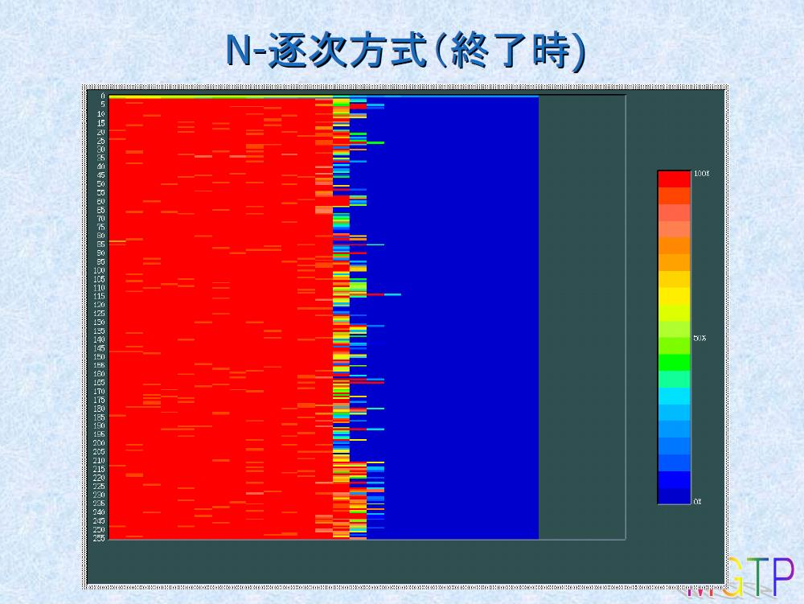

# 从第五代计算机迈向技能科学

心浮气躁，拿AI翻译一点东西，并粗略校对和排版。

原文链接： https://www.ai-gakkai.or.jp/jsai2014/wp-content/uploads/2014/05/413fefda6830ad81ebda8b5491323b22.pdf

----

### 从第五代计算机迈向技能科学

\- 逻辑编程方法 \-

庆应义塾大学 名誉教授 \
嘉悦大学 教授 \
人工智能学会会士 \
古川康一

\* 译注：技能科学，好像是日本那边的提法，英文写作“skill science”

----

### 目录

* 第五代计算机系统项目
    * 幻灯片3~29
* 技能科学的挑战
    * 幻灯片30~66

----

### 第五代计算机系统项目

1982~1992

----

### 第五代计算机项目是什么？
* 1982年至1992年的11年间，由通商产业省（现经济产业省）推动实施的国家级项目
* 通产省以追赶并超越IBM为目标。
* 为此，期望开发出突破性的技术。
* 致力于构建并行推理计算机。
* 项目负责人：渊一博（ICOT所长）
* 其他核心成员：古川康一（ICOT副所长）、横井俊夫、村上国男、内田俊一、上田和纪、近山隆、松本裕治、长谷川隆三、竹内彰一、国藤进、新田克己、井上克巳、泷和男、桥田浩一、向井国昭、...

----

### 第五代计算机项目前夜

* 在美国留学期间，于斯坦福研究所（SRI）发现了科梅拉瓦编写的Prolog解释器列表，并将其带回ETL（1976年）。
* 渕先生对该列表进行了解读并成功运行。
* Prolog热潮由此开启。
* 使用Prolog构建了产生式系统，并成功运行了魔方求解程序。

----

### 用Prolog编写的产生式系统

```prolog
prodSystem(WM, FinalState) :-
    member(FinalState, WM).  % 终止条件

prodSystem(WM, FinalState) :-
    member(Fact, WM),
    recognize(Fact, WM, RHS),  % 识别-执行
    act(RHS, WM, NewWM),
    % 循环
    prodSystem(NewWM, FinalState).

recognize(Fact, WM, RHS) :-
    rule(LHS => RHS),        % 规则的识别
    member(Fact, LHS),       % 条件
    deduce(LHS, WM).
```
----

### 魔方解法规则

```prolog
rule([
    cube(
        front(FC, _, _, _, _, _, _, _, _),
        back(_, _, TC, _, _, _, _, _, _),
        top(TC, _, FC, _, _, _, _, _, _),
        _
    ) = X
] =>
[
    call(apply([lup, bccw, ldown, tright], X, Y)),
    replace(X, Y)
]).
```

----

### FGCS1981的举办

* 1981年10月19~22日，在京王广场酒店举办了关于第五代计算机系统的第一届国际会议
* 主题演讲：元冈达
* 分会报告：唐津一、渊一博、相矶秀夫
* 关于问题解决与推理机制计划的发表：古川
* 渊-费根鲍姆论争

----

### 渊-费根鲍姆论争

* 费根鲍姆："美国专家们从事人工智能研究已有25年。仅就知识工程而言，自研究开始也已过去16年。但日本最多不过数年而已。我认为日本必须付出巨大努力才能追赶上来。"
**（为何不以LISP为基础？）**
* 渊："诸位将日本视若婴孩，但我认为我们已成长至少年阶段。少年确实需要认真听取成人意见并学习，但自主判断不也同样重要吗？正是通过这样的过程，少年才能实现自我成长。"
* 渊："正因我们年轻，才具备兼容并蓄的灵活性。也正因如此，我们才开放地举办了这次国际会议。诸位固然是成年人，但是否因为经验过于丰富，反而失去了正确看待事物的能力呢？"
**（最终作出了着眼于未来选择逻辑编程的决策）**

（今冈和彦：《吾志之第五代计算机》，TBS大英百科，1989）

---

### 艾伦·图灵的构想

* 艾伦·图灵曾探讨计算机实现人工智能的可能性（1950年）。
* 三大方案：
  1. AI by programming,
  2. AI by ab initio machine learning,
  3. AI using logic, probabilities, learning and background knowledge.
* 他主张第三种路径最具发展前景。

图灵文献：
* *Turing, A.M. (1950). Computing machinery and intelligence. Mind, 59, 433-460.*
* *S. Muggleton (2014). Alan Turing and the development of Artificial Intelligence. AI communications, Vol.17, No.1, 3-10*

---- 

### 项目核心理念
* 硬件：非冯·诺依曼计算机
* 软件：知识信息处理
* 编程：并行逻辑编程

*古川康一，《第五代计算机的项目运营与人工智能的未来》，《人工智能》，第29卷第2期，2014年*

---

### 并行逻辑编程

* Prolog的缺陷：无法描述并行处理。因此，
无法编写操作系统。
* 并行逻辑编程的诞生
* 重点关注Keith Clark提出的"在逻辑编程框架下实现并行编程的方案"(1981)

----

### Keith Clark论文(1981)



Keith L. Clark and Steve Gregory. 1981. \
A relational language for parallel programming. In Proceedings of the 1981 conference on functional programming languages and computer architecture, 171–178. ACM Press.

----

### Prolog与并行逻辑编程
* Prolog程序
    ```prolog
    ?- keyboard(K1), keyboard(K2), append(K1,K2, K),
    monitor(K,S), append(S1,S2,S), screen(S1), screen(S2).
    ```
* 各个文字按顺序执行。

* 包含并行处理的逻辑程序
    ```prolog
    ?- keyboard(K1), keyboard(K2), tagmerge(K1,K2, K),
    monitor(K,S), tagmerge(S1,S2,S), screen(S1), screen(S2).
    ```
* 各个文字并行执行。

----

### 核心语言的设计

* 候选语言
    - Keith Clark, Steve Gregory: PARLOG
    - Ehud Shapiro: Concurrent Prolog

* 上田和纪的新提案
    - 提出新语言：Guarded Horn Clauses (GHC)
    - 提出时间：1984年圣诞节

* GHC的优点
    - 通过保护部分的数据流执行规则实现并行控制
    - 不需要注解、模式声明和编译
    - 最为简洁！

----

### GHC开发的意义

* 具有高度的原创性
* 实现了硬件（并行推理机）与软件的同步开发
  * 并行推理机PIM（泷和男）
  * 并行操作系统PIMOS（近山隆）

* 存在的问题：
  * 无法进行回溯
  * 丧失了搜索功能

----

### Manthey与Bry提出的自底向上定理证明器SATCHMO

* SATCHMO：仅由8个子句组成的完整一阶谓词逻辑定理证明程序

```prolog
satisfiable :- is_violated(C), !, satisfy(C), satisfiable.
satisfiable.
is_violated(C) :- (A--->C), call(A), not(C).
satisfy(C) :- component(X,C), asserta(X),
              on_backtracking(retract(X)),
              not(false).
component(X,(Y;Z)) :- !, (X=Y; component(X,Z)).
component(X,X).
on_backtracking(X).
on_backtracking(X) :- call(X), !, fail.
```

Manthey, R. and Bry, F. (1988): SATCHMO: a theorem prover implemented in Prolog.\
Proceedings of CADE 88 (9th Conference on Automated Deduction),SpringerVerlag.

----

### 基于GHC的定理证明器推进

* 研究目标：使用GHC实现SATCHMO
    * 发现古川的论文，项目正式启动
    * 进行原型编码开发
    * 长谷川、藤田开发了对应的解释器
        * 最终发展为MGTP（模型生成定理证明器）
        * 在并行推理机上实现了高速执行（256个处理器达到220倍加速）
* **MGTP的实现展示了并行推理的巨大潜力**

----

### SATCHMO 实现的技巧

* GHC 存在的问题：
    1. GHC 无法实现 OR 并行
    2. 合一运算也存在限制，只有被调用的进程才能给变量赋值

* 问题规避方法：
    1. 用 AND 并行功能替代 OR 并行功能
    2. 利用 SATCHMO 中值域限定条件的特性，规避了合一运算的限制

----

### SATCHMO的GHC解释器（部分）

```prolog
do(A) :- true | satchmo_problem:model(M), false(M,A).

false(M,A) :- true | satchmo_problem:nc(NC),
               satisfy_clauses(0,NC,M,cl_sat,A).

satisfy_clauses(Cn,NC,M,A2,A) :- Cn < NC |
    Cn1 := Cn + 1,
    satisfy_ante(Cn1,[],[true|M],M,A2,A1),
    satisfy_clauses(Cn1,NC,M,A1,A).

satisfy_clauses(NC,NC,_,sat(M1), A) :- true | A = sat(M1).
satisfy_clauses(NC,NC,M,cl_sat, A) :- true | A = sat(M).
satisfy_clauses(NC,NC,M,unsat(Ms),A) :- true | A = unsat(Ms).

satisfy_ante(Cn,GS,[P|M2],M,cl_sat,A) :- true |
    satchmo_problem:c(Cn,P,GS,R),
    satisfy_ante1(Cn,R,P,GS,M2,M,A).

satisfy_ante(Cn,_,[],_,cl_sat,A) :- true | A=cl_sat.
otherwise.
satisfy_ante(_,_,_,_,A1,A) :- true | A=A1.
```

----



（长谷川 模型生成型定理证明系统MGTP要素技术，渊一博纪念学术研讨会《逻辑与推理技术：四分之一世纪的展开》）

----





（长谷川 模型生成型定理证明系统MGTP要素技术，渊一博纪念学术研讨会《逻辑与推理技术：四分之一世纪的展开》）

----

### 其他主要研究成果

* 竹内・藤田开发的Prolog部分求值程序
    * 元解释器的高速化（产生式系统、自底向上分析器等）
    * 基于部分求值的专家系统诊断规则推导（Goebel, Poole, Furukawa）
    * 自适用部分求值程序（H. Fujita）
* 非单调推理、创发推理、归纳推理、类比推理的拓展
    * 归纳逻辑编程系统PROGOL的研究
    * 创发逻辑编程系统ALP的研究
    * 原口诚提出的类比形式化理论

----

### Prolog部分计算器

* Prolog元解释器
    ```prolog
    solve(true).
    solve((P,Q)) :- 
        solve(P), 
        solve(Q).
    solve(G) :- 
        clause(G,B), 
        solve(B).
    ```

* Prolog部分计算器
    ```prolog
    psolve(true,true).
    psolve((G1,G2),(R1,R2)) :-
        psolve1(G1,R1), 
        psolve1(G2,R2).
    psolve(G,R) :- 
        clause(G,B), 
        psolve1(B,R).
    psolve1(G,R) :- 
        proceed(G), 
        psolve(G,R).
    psolve1(G,G) :- 
        stop(G).
    ```
---

### 国内外合作

* 与国内大学相关人员的合作：设立研究协议会
    * 自然语言处理工作组
    * 基础理论工作组等
* 日英、日法、日瑞意、日美等双边及三边研讨会
* 邀请海外著名研究人员（J.A.Robinson, Robert Kowalski, Ehud Shapiro, Keith Clark, Randy Goebel, Stephen Muggleton等）
* 与海外各大学及研究所的学术交流

----

### FGCS项目总体评估

* FGCS是否失败？
    * 未能成功开发出杀手级应用，未能实现实际应用
* 成功之处亦为数众多
    * 取得大量研究成果
        * 技术报告：911份
        * 技术备忘录：1,322份
* 人才培养成果
* 最关键要点：国际主导权

----

#### 挑战技能科学

1995~

(30页)

----

### 技能科学研究（Skill Science）的契机

- **庆应义塾大学SFC校园的文化氛围**
  - 开放创新的学术环境

- **开拓新研究领域的强烈愿望**
  - 追求跨学科研究的突破

- **我个人的专业背景**
  - 多元化的学术经历

- **作为业余大提琴手**
  - 参与大学管弦乐团
  - 参加业余管弦乐团
  - 组建“逻辑编程三重奏”：
    - 钢琴：J.A. Robinson（归结原理发明者）
    - 小提琴：Jacques Cohen
    - 大提琴：古川康一（Koichi Furukawa）

----

### 逻辑编程三重奏（Logic Programming Trio）的演出活动

- **在逻辑编程国际会议上的系列演出**
  - **JICSLP 1992，华盛顿**  
    门德尔松《钢琴三重奏》
  
  - **ICLP 1995，东京**  
    贝多芬《“大公”钢琴三重奏》
  
  - **ICLP 1996，波恩**  
    贝多芬《第三钢琴三重奏》
  
  - **ICLP 1997，鲁汶**  
    德沃夏克《“杜姆卡”钢琴三重奏》
  
  - **JICSLP 1998，曼彻斯特**  
    柴可夫斯基《钢琴三重奏》“纪念伟大的艺术家”

----

### 技能科学相关研究项目

- **庆应义塾大学大型研究项目**  
  **「基于归纳方法的隐性知识语言化」**  
  *研究负责人* | 1995-1996

- **科学研究费补助金·特定领域研究**  
  **「发现科学」**（总负责人：有川节夫）  
  *研究组成员* | 子课题「基于ILP的知识发现」  
  1998-2000

- **科学研究费补助金·基础研究(A)**  
  **「通过知识发现技术实现身体技能的语言化」**  
  *研究负责人* | 2005-2007

- **科学研究费补助金·基础研究(C)**  
  **「基于规则溯因与类比的技能创造」**  
  *研究负责人* | 2012-2014  
  *研究组成员*：藤波努、原口诚、金城启太  
  *研究协作者*：尾崎知伸、升田俊树、西山武繁

----

### 人工智能学会全国大会专题会话

**近未来挑战会话「身体知的阐明」**
- **时间**：2003年 ~ 2007年
- **主旨**：
  人类在艺术、体育等领域展现出难以估量的能力。其速度与精度均令人惊叹。……专业人士所展现的这种惊人能力的源泉是什么？阐明这一点，正是“身体知的阐明”之目的。

**组织会话「身体知的表达与获取」**
- **时间**：2008年 ~ （主席：藤波努）
- **主旨**：
  本会话将使得技能习得成为可能的智能部分视为“身体知”，并旨在讨论其应如何被表达，以及如何被传承。

----

### 目录

- **斯宾拉托奏法的习得**
- **基于规则溯因的说明结构提取**
- **类比溯因**
- **比喻表达的作用**

----

### 关于大提琴斯宾拉托奏法的习得

古川康一 (嘉悦大学)  \
升田俊树 (大提琴演奏家)  \
西山武繁 (庆应义塾大学研究生院政策与媒体研究科)

《日本智能信息与模糊系统学会志》，第24卷第1期，2012年。

---

### 什么是斯宾拉托演奏技法？

- 一种通过高速（每秒3至6次往复运动）弹跳琴弓的演奏技法。
- 斯宾拉托需要同时进行两种重复运动：使琴弓弹跳的上下方向运动，以及发出声音的左右方向运动。
- 需要左手配合右手的动作进行运动。
- 示例视频：https://www.youtube.com/watch?v=cJWjYLG3B7o

---

### 基于强制振动的模型化

- **为何使用强制振动模型？**
  - 这是以手腕为支点的钟摆运动。
  - 需要注入能量，以防止钟摆（运动）衰减。

- **从荡秋千中获得的启示**
  - 在达到最大振幅后、到达最低点之前进行加速。

- **从拍皮球中获得的启示**
  - 通过缓冲动作来吸收因外力加速而产生的冲击。

---

### 基于两种启示的练习

- 在练习斯宾拉托时，能否做到 **“在最大振幅后立即施加外力”**？
  - 现象发生得过快。
  - 但可以在慢速的节拍下找到这种感觉。

- 能否做到 **“缓冲动作”**？
  - 用食指将弓杆压向琴弦，以施加外力。
  - 缓冲动作 = **“轻柔地压住”**。
  - 必须配合琴弓的高速运动周期。
  - 实际上，还存在其他的方法。

---

### 练习与元认知

- 为了加速重复练习的过程，我们进行了**元认知**。
- **通过元认知获得的启示示例**：
  - “顺时针转动手腕。”
  - “突然之间就能做到了。”（1月14日）
  - “与其看弓毛，不如看弓杆。”（1月27日）

---

### 练习进程时间线

- **练习开始**：2010年12月23日
- **初步掌握**：2011年1月15日（突然之间能够做到）
- **显著进步**：2011年1月28日
- **基本纯熟**：2011年5月

---

### 迷你课程带来的启示

- 接受了专家的迷你课程，被指导**使用无名指来持弓**。
- 结果，不稳定的动作被一举消除，从而能够奏出稳定的斯皮卡托（*spiccato*）。
- 发现使用无名指可以实现 **“缓冲动作”** 。（关键的调节点并非食指！）

---

### 基于思维推理的着眼点发现

- **古川康一** - 庆应义塾大学
- **井上克巳** - 国立信息学研究所
- **小林郁夫** - 庆应义塾大学 SFC 研究所
- **诹访正树** - 庆应义塾大学 环境信息学部

第23届人工智能学会全国大会 (2009)

（44页）

---

### “诀窍”与溯因推理

- **“令人惊奇的事实”** 是皮尔士的**溯因推理** 中出现的概念，而为解释该事实寻求假说，就是溯因推理。
- **“诀窍” = “令人惊奇的事实”**，它在获取新技能时提供了契机。
- 通过溯因推理来证明 **“诀窍”的有效性**！

---

### 诀窍与溯因推理

- **“诀窍”并非不证自明**，它需要一个能让人真正理解、豁然开朗的解释。
- **诀窍的结构**：“为完成课题A，只需执行行为B即可”。
- 在**课题A的证明图式**的末端出现了行为B，但二者之间存在**缺失的假设**。
- 也就是说，需要一个关于 **“规则”的假设**。
- 这是一个**规则溯因** 的问题。
- 可利用 **元层级溯因** 来解决。[古川09] [Inoue 09]

---

### 溯因逻辑编程的局限与规则溯因

* **ALP(Abductive Logic Programming，溯因逻辑编程)的局限**
  * 在ALP中，只有**事实**才能被作为假说提出。
* **一阶谓词逻辑上的溯因 + 元层级溯因**
  * **规则**也能作为假说生成。
  * 能够实现**谓词发现**。

```
ALP
├──
│   ├── known
│   └── known
└──
     ├── unknown
     └── known

规则溯因（Rule Abduction）：

课题A
├─unkown
│   ├── known
│   └── known
└── unknown
        └── unknown
              ├── unknown
              │     └── known (行为B)
              └── unknown
                     └── known
```

---

### 基于 SOLAR 的溯因推理

* **SOLAR** 是一个基于**完备一阶谓词逻辑**的定理证明器。
* 当给定**背景知识 B** 和**观测事实 G** 时，溯因推理的目标是从**可假说谓词集 Γ** 中找到一个满足以下两个条件的假说 **H**：
  1. **B ∪ H ⊨ G** (等价于 **B ∧ ¬G ⊨ ¬H**)
  2. **B ∪ H** 是一致的（无矛盾）。

* 其原理是：通过计算 **B ∧ ¬G** 的定理中那些**不属于 B 的定理**的结论 **¬H**，然后对其**取否定**来推导出 H。这种方法被称为**后承寻找**。
* 在此过程中，**SOLAR** 是一个利用 **SOL 推导** 和**表演法** 来高效计算 H 的系统。

**参考文献：**
Nabeshima, H., Iwanuma, K., and Inoue, K.: SOLAR: A Consequence Finding System for Advanced Reasoning, Proc. International Conference on Automated Reasoning with Analytic Tableaux and Related Methods (TABLEAUX 2003), LNCS, Springer, Vol.2796, pp.257-263(2003)

---

### 元层级溯因

* 使用元层级的 `caused` 谓词，将**因果关系**（课题A通过行为B达成）表示为原子公式。
  ```prolog
  caused( spiccato, support_bow_with_ringfinger )
  ```
* 为了表达**因果链**，引入以下公理：
  ```prolog
  caused(A, B) :- connected(A, B).
  caused(A, B) :- connected(A, X), caused(X, B).
  ```
* 其中，`connected` 表示**直接的**因果关系。

(hmmm，图太多，咕咕咕)