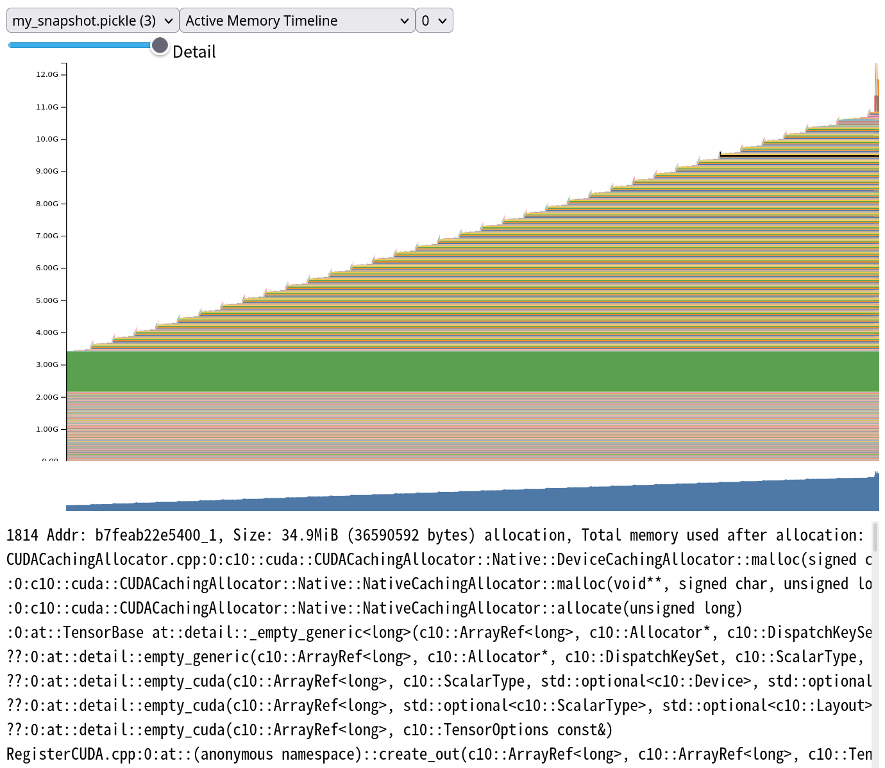
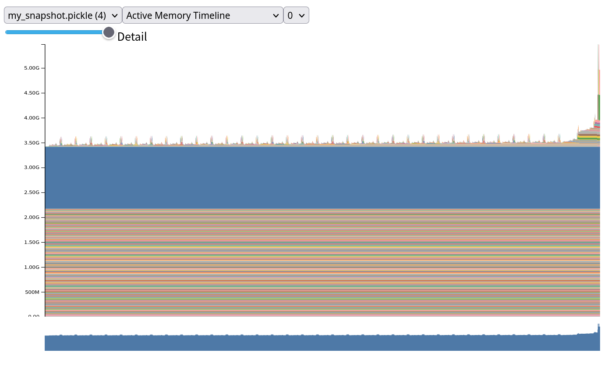
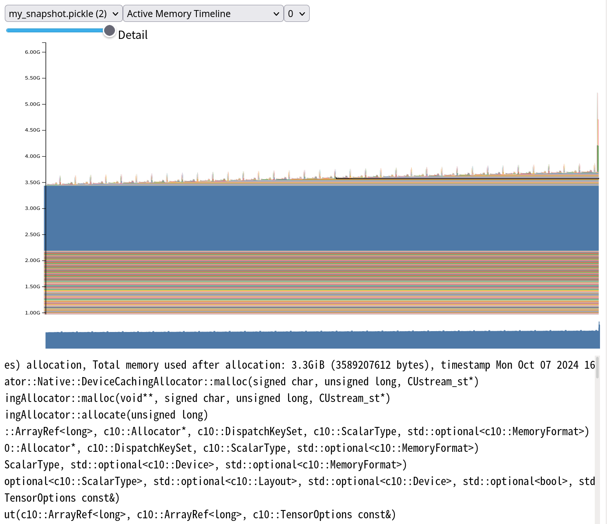

梯度与微调
==========

TAG: gradient; grad; finetuning; lora; grad-checkpoint

pytorch中正常来说，只要你计算并且不带上`with torch.no_grad`，你就会保存每一步的中间值以备反向传播。这非常消耗显存，而且设置requries_grad为False无用，依然会保存中间值。

## 微调

例如我们想要微调Qwen2.5-3B的最后几层：

```python
from transformers import AutoTokenizer, AutoModelForCausalLM, BitsAndBytesConfig
from peft import prepare_model_for_kbit_training
from peft import LoraConfig, get_peft_model
import torch

model_dir = "Qwen2.5-3B"

tokenizer = AutoTokenizer.from_pretrained(model_dir, trust_remote_code=True, padding_side='left')

quantization_config = BitsAndBytesConfig(load_in_4bit=True, bnb_4bit_compute_dtype=torch.bfloat16)
model = AutoModelForCausalLM.from_pretrained(
    model_dir,
    device_map="cuda",
    quantization_config=quantization_config,
)
model = prepare_model_for_kbit_training(model)

targets = ["q_proj", "k_proj", "v_proj", "o_proj", "lm_head"]
target_layers = list(range(len(model.model.layers)))[-2:]

lora_conf = LoraConfig(
        r=8,
        target_modules=targets,
        lora_dropout=0.1,
        bias='none',
        layers_to_transform=target_layers
)

lora_model = get_peft_model(model, lora_conf)

parameters_to_train = filter(lambda p: p.requires_grad, lora_model.parameters())
optimizer = torch.optim.AdamW(parameters_to_train, lr = 3e-4)

test_seq = ["just...", "some.....", "texts......"]

encoded_seq = tokenizer(test_seq, return_tensors="pt", padding=True, add_special_tokens=False)
encoded_seq["labels"] = encoded_seq["input_ids"]

encoded_seq['input_ids'].shape

#torch.cuda.memory._record_memory_history()
out = lora_model(**encoded_seq)
#torch.cuda.memory._dump_snapshot("/dev/shm/my_snapshot.pickle")

out.loss.backward()
optimizer.step()
optimizer.zero_grad()
```

注意，这里requires_grad为True的仅有：

```python
for n, p in lora_model.named_parameters():
    if p.requires_grad:
        print(p.requires_grad, n)

True base_model.model.model.layers.34.self_attn.q_proj.lora_A.default.weight
True base_model.model.model.layers.34.self_attn.q_proj.lora_B.default.weight
True base_model.model.model.layers.34.self_attn.k_proj.lora_A.default.weight
True base_model.model.model.layers.34.self_attn.k_proj.lora_B.default.weight
True base_model.model.model.layers.34.self_attn.v_proj.lora_A.default.weight
True base_model.model.model.layers.34.self_attn.v_proj.lora_B.default.weight
True base_model.model.model.layers.34.self_attn.o_proj.lora_A.default.weight
True base_model.model.model.layers.34.self_attn.o_proj.lora_B.default.weight
True base_model.model.model.layers.35.self_attn.q_proj.lora_A.default.weight
True base_model.model.model.layers.35.self_attn.q_proj.lora_B.default.weight
True base_model.model.model.layers.35.self_attn.k_proj.lora_A.default.weight
True base_model.model.model.layers.35.self_attn.k_proj.lora_B.default.weight
True base_model.model.model.layers.35.self_attn.v_proj.lora_A.default.weight
True base_model.model.model.layers.35.self_attn.v_proj.lora_B.default.weight
True base_model.model.model.layers.35.self_attn.o_proj.lora_A.default.weight
True base_model.model.model.layers.35.self_attn.o_proj.lora_B.default.weight
True base_model.model.lm_head.lora_A.default.weight
True base_model.model.lm_head.lora_B.default.weight
```

然而我们检查内存占用却发现在forward时进行了巨量的内存分配



（工具：pytorch.org/memory_viz，说明见： https://pytorch.org/docs/stable/torch_cuda_memory.html ）

## set_grad_enabled

( 详见[notebook](attachment/top_layer_fine-tuning/disable_grad_for_early_layers.ipynb) )

如果用hook控制梯度的关闭与启用：

```python
def set_grad_hook_false(module, args) -> None:
    torch.set_grad_enabled(False)
    return None

def set_grad_hook_true(module, args) -> None:
    torch.set_grad_enabled(True)
    return None

model.model.embed_tokens.register_forward_pre_hook(set_grad_hook_false)
model.model.layers[target_layers[0]].register_forward_pre_hook(set_grad_hook_true)
```

则能避免保存之前层的激活值，内存占用大大减少：



## 梯度检查点

( 详见[notebook](attachment/top_layer_fine-tuning/checkpointing.ipynb) )

做Gradient checkpointing也可以减少内存占用，只需设置：

```python
model.gradient_checkpointing_enable()
model.train()
```

效果如图：



注意，这里我没有只设置只微调最后几层，而是微调全部层数。

另外，huggingface transformers的gradient_checkpointing有一些不兼容问题，比如它有警告：

```
"`use_cache=True` is incompatible with gradient checkpointing. Setting `use_cache=False`..."
```

如果你像我一样想要玩kv cache，那就要挠头了。

## TODO

* 做点benchmark

## 资料

* Understanding CUDA Memory Usage https://pytorch.org/docs/stable/torch_cuda_memory.html
* pytorch memory_viz https://pytorch.org/memory_viz