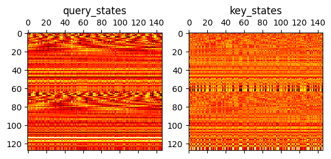

# LLama Internals Visualized

也许你受够了各种教程的嘴炮，从来没见过LLM内部各个计算的真实图像，又懒得自己去debug，那么本notebook正是你所需要的！本文展示了llama-2-7b-hf内部的计算过程所对应的图像，并进行了一些简单的讨论，让你能有一个尽量直观的认识。


```python
from transformers.models.llama.modeling_llama import LlamaForCausalLM, LlamaConfig, LlamaModel, LlamaRotaryEmbedding
from transformers import AutoTokenizer, AutoModel
import transformers
import torch

# src/transformers/models/llama/modeling_llama.py

LLAMA_PATH = '/home/leo/NLP/models/llama/Llama-2-7b-hf'
tokenizer = AutoTokenizer.from_pretrained(LLAMA_PATH, trust_remote_code=True)
tokenizer.add_special_tokens({'pad_token': '[PAD]'})
model = LlamaForCausalLM.from_pretrained(LLAMA_PATH, attn_implementation="eager", torch_dtype=torch.float16).to("cuda")
```

    /home/leo/NLP/.venv/lib/python3.11/site-packages/tqdm/auto.py:21: TqdmWarning: IProgress not found. Please update jupyter and ipywidgets. See https://ipywidgets.readthedocs.io/en/stable/user_install.html
      from .autonotebook import tqdm as notebook_tqdm
    Loading checkpoint shards: 100%|██████████| 2/2 [00:28<00:00, 14.09s/it]
    /home/leo/NLP/.venv/lib/python3.11/site-packages/transformers/generation/configuration_utils.py:410: UserWarning: `do_sample` is set to `False`. However, `temperature` is set to `0.9` -- this flag is only used in sample-based generation modes. You should set `do_sample=True` or unset `temperature`. This was detected when initializing the generation config instance, which means the corresponding file may hold incorrect parameterization and should be fixed.
      warnings.warn(
    /home/leo/NLP/.venv/lib/python3.11/site-packages/transformers/generation/configuration_utils.py:415: UserWarning: `do_sample` is set to `False`. However, `top_p` is set to `0.6` -- this flag is only used in sample-based generation modes. You should set `do_sample=True` or unset `top_p`. This was detected when initializing the generation config instance, which means the corresponding file may hold incorrect parameterization and should be fixed.
      warnings.warn(
    /home/leo/NLP/.venv/lib/python3.11/site-packages/transformers/generation/configuration_utils.py:410: UserWarning: `do_sample` is set to `False`. However, `temperature` is set to `0.9` -- this flag is only used in sample-based generation modes. You should set `do_sample=True` or unset `temperature`.
      warnings.warn(
    /home/leo/NLP/.venv/lib/python3.11/site-packages/transformers/generation/configuration_utils.py:415: UserWarning: `do_sample` is set to `False`. However, `top_p` is set to `0.6` -- this flag is only used in sample-based generation modes. You should set `do_sample=True` or unset `top_p`.
      warnings.warn(


```python
import matplotlib.pyplot as plt

def plt_mat(mat, **kwargs):
    plt.matshow(mat.detach().to('cpu'), cmap='hot', interpolation='none', **kwargs)
    plt.show()

def plt_mat_sub(ax, mat, **kwargs):
    ax.matshow(mat.detach().to('cpu'), cmap='hot', interpolation='none', **kwargs)
```


```python
text = """The political phrase that refers geographically to the area between the Jordan River and the Mediterranean Sea, an area historically called Palestine, which today includes Israel and the Israeli-occupied Palestinian territories of the West Bank and Gaza. In the 1960s, the Palestine Liberation Organization (PLO) used it to call for an Arab state encompassing the entirety of Mandatory Palestine. By 1969, after several revisions, the PLO used the phrase to call for a single democratic state for Arabs and Jews, that would replace Israel. From the river to the sea, palestine will be"""

inputs = tokenizer([text], return_tensors="pt", padding=True, truncation=True).to('cuda')
inputs.data['input_ids'].shape
```


    torch.Size([1, 146])


```python
# outputs of the original model

outs = model(**inputs)

logits = outs['logits'][0]
token_ids = torch.argmax(logits, dim=-1)
tokenizer.decode(token_ids)
```


    'Tags  economy “ has toographically to the area of the Mississippi River and the Mediterranean Sea. and area thatically known Palestine. and is is the, the Palesteli-occupied Westinian territories of the West Bank and thea St\n the 19th7s, the termin Liberation Organization (PLO) was the to refer for the independent state incompassing the entire area of Palestatory Palestine.\n the1978, the the yearsions, the PLO\' the term " refer for a state Palestocratic state in alls and Jews. with would include the and\n   to the sea, Palestestine, be free'


# Embedding


```python
llama_model = model.model

input_ids = inputs.data['input_ids']
input_attention_mask = inputs.data["attention_mask"]
position_ids = torch.arange(input_ids.shape[1]).unsqueeze(0).to('cuda')
cache_position = torch.arange(input_ids.shape[1]).to('cuda')

hidden_states = llama_model.embed_tokens(input_ids)
print(hidden_states.shape)
plt_mat(hidden_states[0], aspect=5)
```

    torch.Size([1, 146, 4096])


    

    


# Causal Mask


```python
causal_mask = llama_model._update_causal_mask(input_attention_mask, hidden_states)
print("causal_mask.shape:", causal_mask.shape)
# upper part (excluding the diagonals) are torch.finfo(dtype).min
print(llama_model.dtype, ".min =", torch.finfo(llama_model.dtype).min)
print(causal_mask)
plt_mat(causal_mask[0][0])
```

    causal_mask.shape: torch.Size([1, 1, 2048, 2048])
    torch.float16 .min = -65504.0
    tensor([[[[    -0., -65504., -65504.,  ..., -65504., -65504., -65504.],
              [    -0.,     -0., -65504.,  ..., -65504., -65504., -65504.],
              [    -0.,     -0.,     -0.,  ..., -65504., -65504., -65504.],
              ...,
              [    -0.,     -0.,     -0.,  ...,     -0., -65504., -65504.],
              [    -0.,     -0.,     -0.,  ...,     -0.,     -0., -65504.],
              [    -0.,     -0.,     -0.,  ...,     -0.,     -0.,     -0.]]]],
           device='cuda:0', dtype=torch.float16)


    

    


```python
print(llama_model.causal_mask.shape)
llama_model.causal_mask
```

    torch.Size([2048, 2048])


    tensor([[False,  True,  True,  ...,  True,  True,  True],
            [False, False,  True,  ...,  True,  True,  True],
            [False, False, False,  ...,  True,  True,  True],
            ...,
            [False, False, False,  ..., False,  True,  True],
            [False, False, False,  ..., False, False,  True],
            [False, False, False,  ..., False, False, False]], device='cuda:0')


# Decoder Layer


```python
# Decoder Layer

target_decoder_layer = llama_model.layers[0]
# type(layer_0)
rest_layers = llama_model.layers[1:]

# layer_outputs = decoder_layer(
#     hidden_states,
#     attention_mask=causal_mask,
#     position_ids=position_ids,
#     past_key_value=past_key_values,
#     output_attentions=output_attentions,
#     use_cache=use_cache,
#     cache_position=cache_position,
# )
```


```python
residual_input = hidden_states
# Input Layer Norm
hidden_states = target_decoder_layer.input_layernorm(hidden_states)
plt_mat(hidden_states[0], aspect=5)
# 嚯, that's very norm
```


    

    


# Self Attention


```python
# Self Attention

# hidden_states, self_attn_weights, present_key_value = self.self_attn(
#     hidden_states=hidden_states,
#     attention_mask=attention_mask,
#     position_ids=position_ids,
#     past_key_value=past_key_value,
#     output_attentions=output_attentions,
#     use_cache=use_cache,
#     cache_position=cache_position,
#     **kwargs,
# )

self_attention = target_decoder_layer.self_attn

bsz, q_len, _ = hidden_states.size()

# QKV

query_states = self_attention.q_proj(hidden_states)
key_states = self_attention.k_proj(hidden_states)
value_states = self_attention.v_proj(hidden_states)

query_states = query_states.view(bsz, q_len, self_attention.num_heads, self_attention.head_dim).transpose(1, 2)
key_states = key_states.view(bsz, q_len, self_attention.num_key_value_heads, self_attention.head_dim).transpose(1, 2)
value_states = value_states.view(bsz, q_len, self_attention.num_key_value_heads, self_attention.head_dim).transpose(1, 2)

```

# Rotary Positional Embedding (RoPE)


```python
cos, sin = self_attention.rotary_emb(value_states, position_ids)
print(sin.shape)

fig, (ax1, ax2) = plt.subplots(1, 2)
plt_mat_sub(ax1, sin[0].T)
ax1.set_title("sin")
plt_mat_sub(ax2, cos[0].T)
ax2.set_title("cos")
plt.show()

# there's 2 sections, which is produced by the rotate_half
# I see there's a need to negate half, but why rotate?
```

    torch.Size([1, 146, 128])


    

    


```python
# before RoPE, let's plot the 3rd head [0][2]
fig, (ax1, ax2) = plt.subplots(1, 2)
plt_mat_sub(ax1, query_states[0][2].T)
ax1.set_title("query_states")
plt_mat_sub(ax2, key_states[0][2].T)
ax2.set_title("key_states")
plt.show()
```


    

    


```python
# Let's RoPE
from transformers.models.llama.modeling_llama import apply_rotary_pos_emb
query_states_rope, key_states_rope = apply_rotary_pos_emb(query_states, key_states, cos, sin)
fig, (ax1, ax2) = plt.subplots(1, 2)
plt_mat_sub(ax1, query_states_rope[0][2].T)
ax1.set_title("query_states")
plt_mat_sub(ax2, key_states_rope[0][2].T)
ax2.set_title("key_states")
plt.show()
```


    

    


```python
data = query_states_rope[0][2].detach().to("cpu")
seq_len, head_dim = data.shape

for i in range(5, 128//2, 16):
    plt.plot(range(seq_len), data.T[i], label=f"embedding element pos={i}")
plt.legend()
plt.title('RoPE encoded inputs over Hidden Dim')
plt.xlabel('x_i')
plt.ylabel('PE query_state')
plt.show()
```


    

    


```python
fake_query_states = torch.ones([1,32,q_len,128], dtype=torch.float, device='cuda')
fake_key_states = torch.ones([1,32,q_len,128], dtype=torch.float, device='cuda')
fake_rope_query_states, fake_rope_key_states = apply_rotary_pos_emb(fake_query_states, fake_key_states, cos, sin)
# We have:
# q_embed = (q * cos) + (rotate_half(q) * sin)
# k_embed = (k * cos) + (rotate_half(k) * sin)
# so basically:
# q_embed = (1 * cos) + (rotate_half(1) * sin)
# k_embed = (1 * cos) + (rotate_half(1) * sin)
import math
fake_attn_weights = torch.matmul(fake_rope_query_states, fake_rope_key_states.transpose(2, 3)) / math.sqrt(self_attention.head_dim)

fig, (ax1, ax2) = plt.subplots(1, 2, figsize=(10, 5))
plt_mat_sub(ax1, fake_attn_weights[0][0])
ax1.set_title('Attention Matrix on All 1 Input')
ax2.plot(torch.arange(q_len), fake_attn_weights[0][0][0].detach().to("cpu"))
ax2.set_aspect(20)
ax2.set_title('Long-term decay?\n(RoFormer paper Fig 2?)')
ax2.set_xlabel('relative position')
ax2.set_ylabel('attention value')
plt.show()
```


    

    


```python
data = fake_rope_query_states[0][2].detach().to("cpu")
seq_len, head_dim = data.shape

for i in range(5, 128//2, 16): # There's 2 sections of the RoPE, just check the first
    plt.plot(range(seq_len), data.T[i], label=f"embedding element pos={i}")
plt.legend()
plt.title('RoPE, PE over Hidden Dim (all 1 inputs)')
plt.xlabel('x_i')
plt.ylabel('PE query_state')
plt.show()
```


    

    


# Grouped Multi-head Query

TODO


```python
# repeat KV for the llama GHQ (does nothing here :-P)
from transformers.models.llama.modeling_llama import repeat_kv

key_states_after_repeat = repeat_kv(key_states_rope, self_attention.num_key_value_groups)
value_states_after_repeat = repeat_kv(value_states, self_attention.num_key_value_groups)
```

# Scale Dot Product Attention

$\frac{QK^T}{\sqrt{\text{dim}}}$


```python
# Attention is all you need
import math
# Q x K
attn_weights = torch.matmul(query_states_rope, key_states_after_repeat.transpose(2, 3)) / math.sqrt(self_attention.head_dim)
print("attn_weights", attn_weights.shape)
```

    attn_weights torch.Size([1, 32, 146, 146])


```python
# some interesting ones
interesting_ones = [3, 7, 15]

fig, axes = plt.subplots(1, len(interesting_ones), figsize=(15, 5))
for ax, i in zip(axes, interesting_ones):
    plt_mat_sub(ax, attn_weights[0][i])
    ax.set_title(f"attn_weights[0][{i}]")
plt.show()
```


    

    


# Applying Causal Mask


```python
cropped_causal_mask = causal_mask[:, :, cache_position, : key_states_after_repeat.shape[-2]]
print("cropped_causal_mask.shape:", cropped_causal_mask.shape)
plt_mat(cropped_causal_mask[0][0])
```

    cropped_causal_mask.shape: torch.Size([1, 1, 146, 146])


    

    


```python
attn_weights_masked = attn_weights + cropped_causal_mask

# show again:
fig, axes = plt.subplots(1, len(interesting_ones), figsize=(15, 5))
for ax, i in zip(axes, interesting_ones):
    plt_mat_sub(ax, attn_weights_masked[0][i], vmin=0) # need the vmin, otherwise will see only black and white
    ax.set_title(f"attn_weights[0][{i}]")
plt.show()
```


    

    


# Softmax x V

Attention = $\text{Softmax}(\frac{QK^T}{\sqrt{\text{dim}}})V$


```python
plt_mat(value_states_after_repeat[0][8])
```


    

    


# Softmax

$$
\sigma(z)_j = \frac{e^{z_j}}{\sum^K_{k=1}e^{z_k}} \text{for} j=1, ..., K
$$


```python
data = attn_weights_masked[0][21]
data_slice = [60, 80, 100, 120]

fig, (ax1, ax2, ax3) = plt.subplots(1, 3, figsize=(15, 5))

plt_mat_sub(ax1, data, vmin=0)
ax1.set_title('masked_attn_weights[0][21]')

for slice_index in data_slice:
    ax2.plot(torch.arange(q_len), data[slice_index].detach().to('cpu'), label=f'row={slice_index}')
ax2.set_title('masked attn weights before softmax')
ax2.set_ylim(top=5, bottom=-5)
ax2.legend()

import numpy as np

bin_weights = torch.linspace(-6, 6, 30)
for slice_index in data_slice:
    slice_tensor = data[slice_index].detach().to(dtype=torch.float, device='cpu') #.to(dtype=torch.float32, device='cpu')
    hist, edges = np.histogram(slice_tensor, bins=bin_weights)
    ax3.plot(edges[:-1], hist)
ax3.set_title('value distribution')
ax3.set_ylabel('count')

plt.show()
```


    

    


```python
attn_weights_softmax = torch.nn.functional.softmax(attn_weights_masked, dim=-1, dtype=torch.float32).to(query_states.dtype)
#attn_weights_upcast = torch.nn.functional.dropout(attn_weights, p=self.attention_dropout, training=self.training)

fig, (ax1, ax2, ax3) = plt.subplots(1, 3, figsize=(15, 5))
head_index = 2
plt_mat_sub(ax1, attn_weights_softmax[0][head_index])
ax1.set_title(f'attn_weights[0][{head_index}] after softmax')
for i in range(0, q_len, q_len//5):
    ax2.plot(torch.arange(q_len), attn_weights_softmax[0][0][i].detach().to('cpu'), label=f"row={i}")
ax2.legend()
ax2.set_yscale('log')
ax2.set_title('row values (log scaled y axis)')

for i in range(0, q_len, q_len//5):
    ax3.plot(torch.arange(q_len), attn_weights_softmax[0][0][i].detach().to('cpu'), label=f"row={i}")
ax3.legend()
ax3.set_title('row values (linear y axis)')

plt.show()
```


    

    


## Softmax is so flat?


```python
def plot_softmax(ax, seq_len):
    randn_seq = torch.randn(seq_len)
    ax.plot(torch.arange(seq_len), randn_seq, label='original seq (torch.randn)')
    ax.plot(torch.arange(seq_len), torch.softmax(randn_seq, -1), label='after softmax')
    ax.set_title(f"seq_len={seq_len}")
    ax.legend()

fig, (ax1, ax2) = plt.subplots(1, 2, figsize=(10, 5))
plot_softmax(ax1, 100)
plot_softmax(ax2, 5)
fig.suptitle("softmax is very flat when seq_len is slightly longer than your class example")
plt.show()
```


    

    


# Attention x V


```python
attn_weights_softmax = torch.nn.functional.softmax(attn_weights_masked, dim=-1, dtype=torch.float32).to(query_states.dtype)

# x V
attn_output = torch.matmul(attn_weights_softmax, value_states_after_repeat)
print(attn_output.shape)
plt_mat(attn_output[0][8])
```

    torch.Size([1, 32, 146, 128])


    

    


```python
# reshape into embeddings

attn_output = attn_output.transpose(1, 2).contiguous()
attn_output = attn_output.reshape(bsz, q_len, self_attention.hidden_size)
print(attn_output.shape)
```

    torch.Size([1, 146, 4096])


```python
# output proj

attn_output = self_attention.o_proj(attn_output)

# Add residual

hidden_states = residual_input + attn_output
residual_after_attention = hidden_states
# post attention layer norm
hidden_states = target_decoder_layer.post_attention_layernorm(hidden_states)
```

# MLP


```python
from transformers.models.llama.modeling_llama import LlamaMLP

mlp_layer: LlamaMLP = target_decoder_layer.mlp

up = mlp_layer.up_proj(hidden_states)
gated = mlp_layer.act_fn(mlp_layer.gate_proj(hidden_states))

# positional multiply
hidden_states = mlp_layer.down_proj(gated * up)

hidden_states = residual_after_attention + hidden_states
```

# Rest layers


```python
for decoder_layer in rest_layers:
    hidden_states = decoder_layer(
        hidden_states,
        attention_mask=causal_mask,
        position_ids=position_ids,
        past_key_value=None,
        output_attentions=False,
        use_cache=False,
        cache_position=cache_position,
    )[0]

hidden_states = llama_model.norm(hidden_states)
```


```python
# Output
lm_head_output = model.lm_head(hidden_states)
print(lm_head_output.shape)
most_fit_token_ids = torch.argmax(lm_head_output, dim=-1)[0]
tokenizer.decode(most_fit_token_ids)
```

    torch.Size([1, 146, 32000])


    'Tags  economy “ has toographically to the area of the Mississippi River and the Mediterranean Sea. and area thatically known Palestine. and is is the, the Palesteli-occupied Westinian territories of the West Bank and thea St\n the 19th7s, the termin Liberation Organization (PLO) was the to refer for the independent state incompassing the entire area of Palestatory Palestine.\n the1978, the the yearsions, the PLO\' the term " refer for a state Palestocratic state in alls and Jews. with would include the and\n   to the sea, Palestestine, be free'

