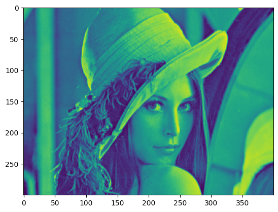

pytorch中将图片切分为小块
--------------------

tags: pytorch, split, image, tiles, fold, unfold

效果图放前面：


能搜到一些pytorch中切tile的讨论，但都很抽象没有图片，也不知道能不能用，故作此文。

不多BB，直接上代码，你可以拷到Jupyter Notebook里面玩玩，Lenna奶奶的图请自备。

```python
import torch
import matplotlib.pyplot as plt

import torchvision

tile_size = 50
original_image = torchvision.io.read_image('lena_std.png', torchvision.io.ImageReadMode.GRAY_ALPHA)[0]
h, w = original_image.shape

# 注意，Unfold只接受形如(N, C, <Dimension>)的张量，N为batch size，C为channel
# 此处我们就一张图，一个灰度channel，故为：(1, 1, h, w)，此处为[1, 1, 300, 400]
# 原图为512x512，我裁切了一下变为宽400，高300，让你能分清高度和宽度，便于直接使用
original_image = original_image.view(1, 1, h, w).to(torch.float)
print(original_image.shape)
plt.imshow(original_image[0][0])
plt.show()

# 原图为：
```



```python
# 定义Unfold，这很直观
unfold_layer = torch.nn.Unfold(kernel_size=(tile_size, tile_size), stride=tile_size)

splited = unfold_layer(original_image)
print(splited.shape)
# 此处大小为[1, 2500, 48]，以一个[batch_size, tile_pixel_num, tile_num]的形式输出，非常抽象

splited = splited.permute(0, 2, 1) # [batch_size, tile_num, flatten_size]，把我们的像素放到最后去方便操作
splited = splited.reshape(1, h // tile_size, w // tile_size, tile_size, tile_size)
# tile_num -> [h // tile_size, w // tile_size]
# flatten_size -> [tile_size, tile_size]
# 这里应该很形象，变成了我们想看的(batch_size, row, col, tile_size, tile_size)形式，可以用row, col访问每一个tile

fig, axes = plt.subplots(h // tile_size, w // tile_size)
for row in range(len(axes)):
    for col in range(len(axes[0])):
        tensor = splited[0][row][col]
        ax = axes[row][col]
        ax.imshow(tensor)
        ax.axis('off')
plt.tight_layout()
plt.show()
# 图就切好了，看起来不错
```


```python
# 用Fold合并回去
fold_layer = torch.nn.Fold(output_size=(h, w), kernel_size=(tile_size, tile_size), stride=tile_size)

# 实际上就是反过来
to_fold = splited.view(
    1, # batch_size
    (h // tile_size * w // tile_size), # 这么多个tile
    tile_size* tile_size # 每个tile这么多像素
    ).permute(0, 2, 1) # 满足他那个抽象的[batch_size, tile_pixel_num, tile_num]顺序

folded = fold_layer(to_fold)
print(folded.shape) # [1, 1, 300, 400], 复原成功！

plt.imshow(folded[0][0])
plt.show()
```


